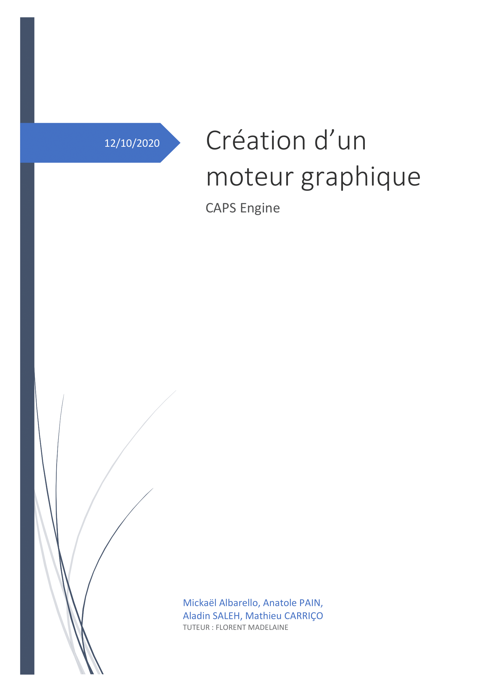
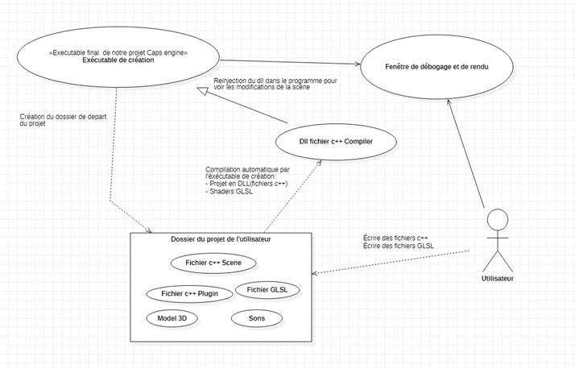
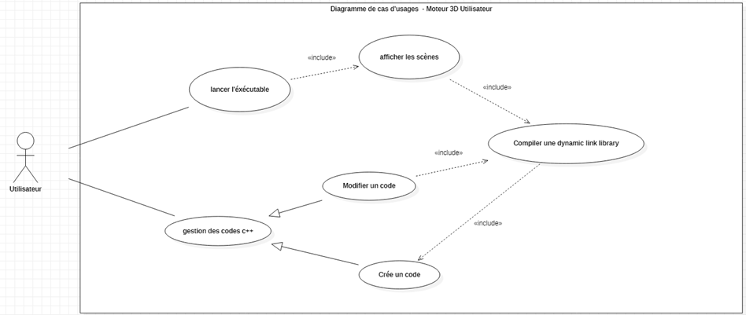
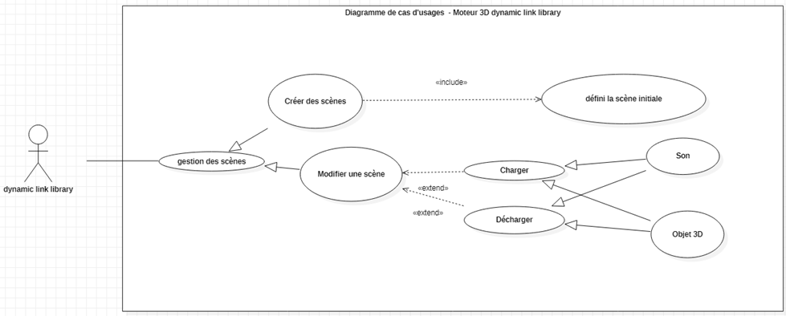
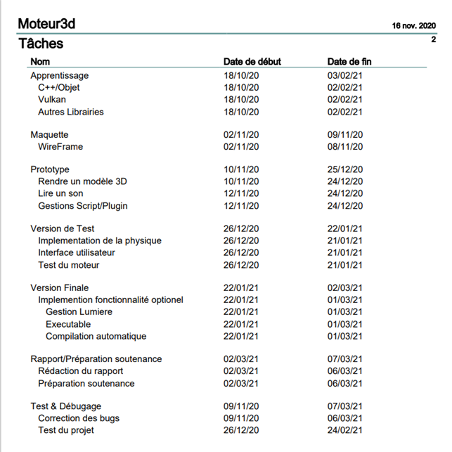
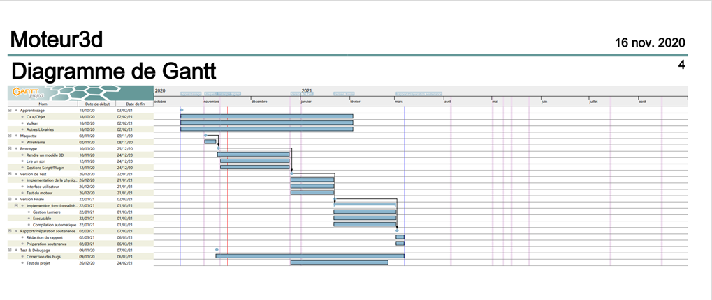

# Présentation du contexte

## Introduction :

​	Notre projet consiste à développer un moteur graphique 3D en C++ et via l'API Vulkan, le but est de proposer un outil de développement graphique 3d capable d'afficher des modèles plus ou moins complexes, leur appliquer de la physique et créé un système de son spatial dans cet environnement. Pour cela nous aurons besoin d’une carte graphique supportant l’API Vulkan et de différentes bibliothèques définies dans « l’existant ». 

​	Nous rencontrerons deux contraintes : une contrainte de temps, car le projet doit être terminé et livré avant le 8 mars, c’est-à-dire 6 mois de réalisation. A cela une deuxième contrainte d’apprentissage, en effet une mise à niveau de toute l’équipe est indispensable. (C++, API Vulkan etc.…)

​	Notre projet s’adresse à des utilisateurs en conception 3D qui utilise notre application pour visualiser les objets. Notre client hypothétique pourrait être un studio d’animation, de jeux vidéo ou des entreprises qui aurait besoin de modéliser la physique de certain élément.

 

## Synopsis :

L'utilisateur lance notre programme (exécutable). Une première fenêtre s'affiche permettant d'indiquer le dossier de départ du projet, il choisit un dossier et le valide. Elle se ferme, puis une seconde fenêtre montrant différentes informations de débogage s'affiche. À la racine du dossier de départ, différents dossiers et fichiers sont créés.

L'utilisateur va créer des fichiers codés en C++ dans un sous dossier.

Il écrit du code donnant différentes instructions afin de modifier la position de l’objet ou bien même la physique par exemple. Il va ensuite importer des modèles 3d « .obj » d'une balle en mousse, et un fichier de son « .wav ».

Malheureusement, pendant qu'il code son fichier C++, il fait une erreur. La fenêtre de débogage le prévient automatiquement et il la corrige.

Quand il a fini, il peut lancer le rendu de la scène qu'il vient de coder grâce à un bouton sur la fenêtre. Elle s’affiche.

Mais la position de la balle ne lui plaît pas, il va modifier ses coordonnées dans les fichiers C++.
 D’un point de vue technique, les fichiers C++ son compilés automatiquement en dll (librairy Dynamic), puis réinjectés dans l’exécutable de création, ce qui met à jour automatiquement la fenêtre de rendu ou de débogage.

------

Après plusieurs heures de travail, l'utilisateur est content de son résultat. Il va donc exporter son rendu graphique en appuyant sur le bouton de la fenêtre prévu à cet effet. Cela ouvre un sélecteur de fichier pour indiquer son emplacement. Il valide, et différents dossiers se créent avec tout le nécessaire plus un exécutable qui lance le rendu.

 

## Esquisser l’existant :

Nous disposons d’ordinateurs personnels disposant d’une carte graphique. Nous disposons aussi de différente bibliothèque. Nous disposons aussi d’outils (API, et bibliothèques (compatible Windows et Linux)) qui nous permettrons de mener à bien notre projet. Elles nous permettront par exemple de gérer de manière complexe la carte graphique, ou d’utiliser sans encombre les pilotes audios de nos ordinateurs. Pour l’aspect Interface Homme Machine nous disposons aussi de bibliothèque appropriée. Nous avons aussi besoin d’une interface de gestion de la fenêtre, d’une bibliothèque qui s’occupe de l’interprétation des fichiers .obj ainsi que les formats d’images classiques (.png, .jpeg, …). Dans une espérée simulation de la physique nous implémenterons une bibliothèque prévue à cet effet.

# Étude détaillée des objectifs (analyse des besoins).

## Les fonctionnalités attendues :

- Afficher des modèles 3D
- Charger des Scènes
- Charger et gestion des sons dans l'espace
- Gérer les scènes à l'aide de script/plugin
- Ajouter de la physique sur les objets

 

**Lexique :** La **scène** correspond à la scène 3D contenant une hiérarchie d'objets 3D ainsi que leur paramètres (position, etc.). Plusieurs scènes peuvent être créées dans un même projet.

## Digramme de cas d’usages :

# Calendrier et priorisation des objectifs.

## Priorisation des objectifs : notation MoSCoW :

| |  |
| ---- | ------------------------------------------------------------ |
| **Must (vital)** | **Gérer les scènes :** - Charger la scène - Charger/Afficher des modèle 3d et sons - Charger les scripts/plugins  **Moteur de rendu** : - Cree la fenêtre - Cherchez carte Graphique - Surface de rendu - Chaine d'image - Type de vue  - Module des shaders - Compilateur de shaders (.glsl) vers (.spirv) - Charger des shaders (.spirv) - Effectuer le rendu - Charger des modèles 3d  **Interface utilisateur débogage :** - Modifier les cordonnées d’un objet - Afficher la console. - Afficher la hiérarchie de la scène. - Afficher les Informations essentielles (image par secondes, nombre de script/plugin, …) |
| **Should (essentiel)** | **Spatialisation sonore :** - Charger des fichier sonore (.wav) - Modélisation du son dans un programme - Lecture des sons 				- Source 				- Auditeur |
| **Could (comfort)** | -	Moteur physique. -	Interface de création de scène. |
|**Won't (Probablement jamais livré mais envisageable) :** | \-     Gestion des lumières |

## Diagramme de Gantt :

## Diagramme d’illustration des différentes liaisons entre les librairies : 

-     L’API Vulkan qui dispose de fonctions liées à la carte graphique.
-     De la bibliothèque GLFW qui permet la gestion de la fenêtre. 
-    De la bibliothèque OpenAL-Soft qui gère le son. 
-     De la bibliothèque Bullet3 qui gère la gravité et les interactions de collision. 
-     De la bibliothèque TinyOBJLoader qui permet de manipuler des modèle 3D (.obj)
-     De la bibliothèque GLM qui gère différentes fonctions mathématiques complexe 
-     ImgUI bibliothèque d’interface graphique 