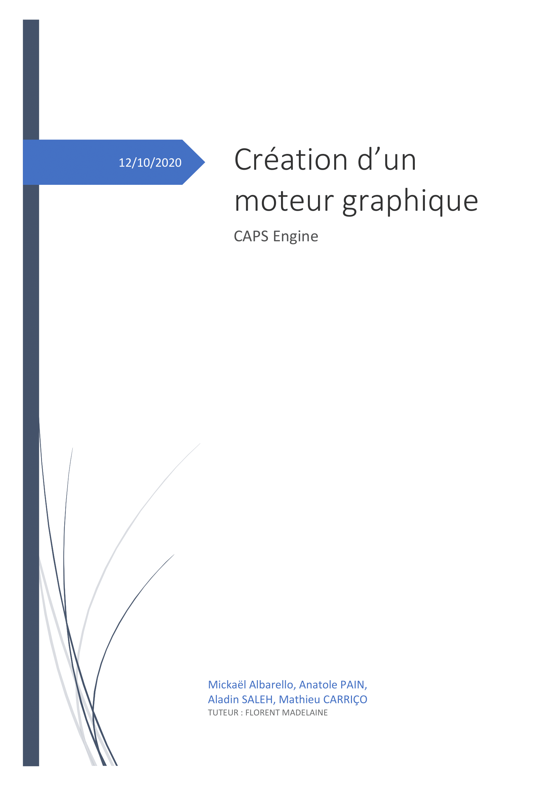
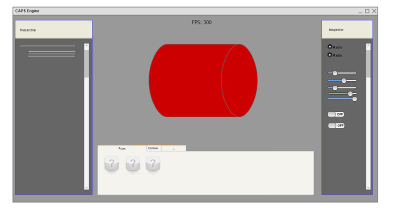

# Introduction :

Ce document est le cahier des charges technique de notre projet de deuxième année de DUT informatique à l’IUT Sénart-Fontainebleau, il fait suite au premier cahier des charges (le cahier des charges fonctionnel), il est donc fortement recommandé d’avoir pris connaissance de ce dernier avant de consulter celui-ci.

Dans ce cahier des charges nous expliquerons les parties plus techniques comme le choix des bibliothèques, du langage de programmations des méthodes de travail, des contraintes ainsi qu’une bibliographie.

 

# Langages :

 En ce qui concerne les langages  que nous avons choisis pour le développement de ce projet le C++ est vite devenus une évidence pour plusieurs raisons.

La première raison est tout d’abord les performances de ce dernier, malgré une portabilité bien moindre en comparaison à celle du java les performances apportés par le C++ ne sont vraiment pas négligeables surtout étant donné la quantité de calculs sur des matrices que nous effectuerons tout au long du projet. 

Il y a aussi comme langage le GLSL qui est très important afin d’assurer le rendu graphique via le processeur de la carte graphique (GPU). Pour la sélection de ce langage nous n’avions pas vraiment de choix à effectuer puisque c’est  le langage de programmation de shaders le plus rependu.

De plus nous utiliserons un compilateur SPIR-V ce qui va nous permettre de précompiler les shaders codé en GLSL en SPIR-V binarisé ce qui va nous permettre d’utilisé les shaders un peu comme bon nous semble puisque ce fichier est transpilable vers d’autres langage de shaders(HLSL, MSL, OSL,…) et donc permet de donné a l’utilisateurs plus de libertés.

# Contraintes :

Les contraintes sont tout d’abord des contraintes de temps puisque nous avons 6 mois pour accomplir le projet que nous nous somme fixer. Mais le plus gros des contraintes concernant ce projet sont les contraintes matérielles puisque étant donné la nature de notre projet n’importe quelle machine n’est pas apte à faire fonctionner notre projet car comme précisé il faut une carte graphique  supportant l’API vulkan. Cette API étant récente toutes les cartes graphiques ne la supportent pas forcement ce qui peux entrainer des disfonctionnements.

La contrainte précédente entraine donc une deuxième contrainte puisque étant donné la nature de notre projet nous devrions tester notre projet. Sur de multiples machines ce qui est très vite limité dans un premier temps a cause des mesures de confinement prisent par notre gouvernement puis dan s un second temps le fait que nous développions un projet universitaire et que nous n’ayons pas réellement un budget afin de faire des tests de déploiement de notre moteur graphique.

Si nous restons toujours dans les contraintes matérielles ces dernières nous limitent aussi d’un point de vue des technologies utilisable tel que le Ray tracing (système de calcule pour l’application des éclairages dans une scène).

En plus des contraintes matérielles nous avons des contraintes d’apprentissage, puisque par exemple nous n’avons pas étudié le C++ dans le cadre de notre formation à l’IUT Sénart-fontainebleau. De plus il y a beaucoup de notions à apprendre de manière autodidacte, il y a par exemple la manière l’API vulkan fonctionne ce qui passe par la lecture et l’apprentissage d’une documentation plutôt conséquente ainsi qu’un long travail de recherche d’exemples afin d’affinés la compréhension et permettre l’application de ce qui a été précédemment vue dans la documentation.

 

# Méthodes de travail :

La méthode utilisée pendant le projet provient surtout des principes de l’« extreme programming » car c’est la plus légère des méthodes et elle est plus adaptée aux environnements changeant de notre projet.

<u>**Pair programming** :</u>

Du fait de la complexité du code, nous utilisons beaucoup de « pair programming ». Cette méthode consiste à écrire le code en binôme, où une personne écrit et une autre relit derrière. Elle a plusieurs avantages : elle permet de voir plus vite les nombreux bugs et de proposer des solutions pour ne pas rester bloqué. On avance plus vite, et on reste motivé. Dans la même logique nous lisons la documentation ensemble pour mieux la comprendre. C’est pour cela que dans certains cas nous nous sommes répartis en deux binômes.  

Le « pair programming » s’effectue généralement sur un même écran en présentiel mais il fonctionne aussi très bien à distance. Une personne partage son écran via Discord, et l’autre le regarde. Il était nécessaire de bien comprendre et écouter l’autre, d’améliorer sa communication pour mieux s’expliquer. 

Il nous permet aussi d’être mieux être au courant du code de l’autre et il devient dès lors plus simple d’aider un coéquipier qui rencontrait un bug pendant les phases de travail en solo. 

<u>**Refactoring  :**</u>

Une restructuration du code a été fait aux deux tiers du projet pour qu’il soit plus propre et plus standard en remplaçant les nombreuses classes statiques par des classes implémentant une interface. 

<u>**Méthodes « en Cascades » :**</u>

Pour gérer l’emploi du temps, nous utilisons une méthode classique en « cascades », les taches sont faites sur Gantt et mise à jour aux furs et à mesure des besoins.

# Bibliothèques : 

- L’API Vulkan qui dispose de fonctions liées à la carte graphique. Nous avons eu à faire un choix entre 2 API OpenGL ou Vulkan nous avons décidé de choisir cette API pour plusieurs raisons. Dans un premier temps la modernité la première version de Vulkan date de 2016 ce qui est quand même assez jeune en comparaisons avec OpenGL (première version en 1994), de plus Krhonos Group c’est énormément inspiré d’OpenGL et Metal (Apple) dans le développement de Vulkan en simplifiant ces derniers. De plus contrairement a des API comme DirectX ou Metal Vulkan est multiplateforme.
- La bibliothèque GLFW qui permet la gestion de la fenêtre de notre application elle a pour principale atout d’être cross-platform tout comme Vulkan. 
- La bibliothèque OpenAL-Soft qui gère le son. Etant donné son utilisation très fréquente dans le domaine du jeux vidéo cette bibliothèque est un choix assez pertinent dans le cadre de développement d’un moteur graphique.
- De la bibliothèque Bullet3 qui gère la gravité et les interactions de collision.  Nous avons choisi cette bibliothèque pour son coté multiplateforme comme les bibliothèques précédentes.
- De la bibliothèque TinyOBJLoader qui permet de manipuler des modèle 3D (.obj) Si nous avons décidé d’utiliser cette bibliothèque c’est pour une raison pratique étant donné qu’elle est utilisée dans la plupart des projets sous Vulkan cela nous a permis de facilité la compréhension de cette dernière ainsi que d’avoir des retours sur des problèmes et autres bugs que nous pouvons rencontrer suite a une mauvaise utilisation de cette dérnière.
- De la bibliothèque GLM qui gère différentes fonctions mathématiques complexe  Cette bibliothèque a été choisis tout simplement car nous n’avons pas trouvé mieux et que la manipulation de matrices dont nous avons usage dans notre projet pourrait faire l’œuvre d’un projet a part entière au vu de sa complexité
- ImgUI bibliothèque d’interface graphique le choix de cette dernière est apparu comme une évidence étant donné qu’elle est raccord avec nos choix précédent puisque cette dernière implémente aussi bien l’API Vulkan que la bibliothèque GLFW
- STB permet de charger n’importe qu’elle image
- VulkanMemoryAllocator permet de corriger la limitation du nombre de buffers sous vulkan puisque vulkan limite la quantité de buffer a 4096 ce qui devient très vite relativement peux si nous voulons permettre la création de scène complexe avec une grosse quantité d’objets dans cette dernière

 

# Proposition de design : 

# Bibliographie : 

1. **<u>Vulkan :</u>**
   1. **<u>Vulkan Tutorial:</u>** 
      https://vulkan-tutorial.com/
   2. <u>**Documentation Vulkan:**</u>
      https://www.khronos.org/registry/vulkan/specs/1.2/styleguide.html

2. <u>**GLFW :**</u>
   1. <u>**Documentation :**</u>
      https://www.glfw.org/docs/latest/
   
3. <u>**OpenAl-soft**</u>
   1. <u>**Documentation :**</u>
      https://www.openal.org/documentation/
   
4. **<u>Bullet3</u>**
   1. <u>**Documentation :**</u>
      http://www.cs.kent.edu/~ruttan/GameEngines/lectures/Bullet_User_Manual
   
5. **<u>TinyOBJLoader</u>**
   1. <u>**Documentation :**</u>
      https://vulkan-tutorial.com/Loading_models
   
6. <u>**GLM**</u>
   1. <u>**Documentation/git :**</u>
      https://github.com/g-truc/glm
   
7. **<u>ImgUI</u>**
   1. <u>**Tuto :**</u> 
      - https://frguthmann.github.io/posts/vulkan_imgui/
      - https://blog.conan.io/2019/06/26/An-introduction-to-the-Dear-ImGui-library.html
   
8. **<u>Vulkan memory allocator</u>**
   1. **<u>Github : </u>**
      https://github.com/GPUOpen-LibrariesAndSDKs/VulkanMemoryAllocator
   
9. <u>**Stb :**</u>
   https://github.com/nothings/stb/tree/e6afb9cbae4064da8c3e69af3ff5c4629579c1d2/docs